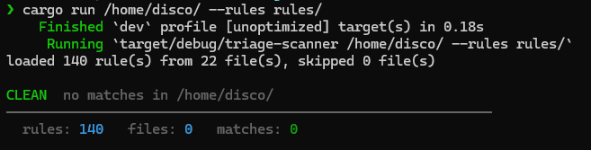
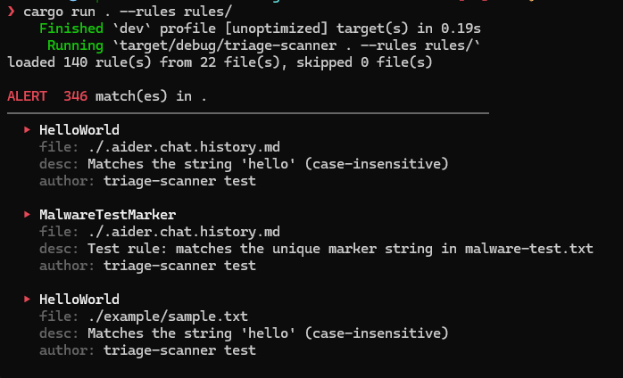
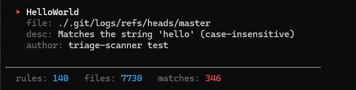

# triage-scanner

A fast, parallel file scanner that uses [YARA-X](https://github.com/VirusTotal/yara-x)
rules to triage files and directories for malware indicators.







## How it works

1. **Load rules** — YARA rules are read from a single `.yar`/`.yara` file or
   recursively from a directory. All sources are compiled into a single
   `yara_x::Rules` set.
2. **Walk the target** — The target file or directory is traversed with
   `walkdir`. Each file is scanned independently.
3. **Scan in parallel** — Files are scanned across a Rayon thread pool
   (defaults to the number of CPUs, configurable with `-j`).
4. **Report matches** — Each rule match is collected along with its metadata
   (`description`, `author`, `severity`) and rendered as either human-readable
   text or JSON.

## Usage

```bash
triage-scanner <TARGET> --rules <RULES>
```

### Arguments

| Flag | Description |
| --- | --- |
| `<TARGET>` | File or directory to scan |
| `-r, --rules <RULES>` | YARA rule file or directory of `.yar`/`.yara` files |
| `-j, --threads <N>` | Number of worker threads (defaults to number of CPUs) |
| `-f, --format <FORMAT>` | Output format: `text` (default) or `json` |
| `-q, --quiet` | Suppress non-essential output |

### Examples

Scan a directory with a rules folder:

```bash
triage-scanner ./samples --rules ./rules
```

Scan a single file and emit JSON:

```bash
triage-scanner suspicious.bin --rules rules/malware-test.yar --format json
```

## Exit codes

| Code | Meaning |
| --- | --- |
| `0` | Scan completed with no matches |
| `1` | One or more matches were found |
| `2` | An error occurred (bad rules, unreadable target, etc.) |

## Output

The JSON report has the following shape:

```json
{
  "target": "./samples",
  "rules_loaded": 12,
  "files_scanned": 340,
  "matches": [
    {
      "file": "./samples/evil.bin",
      "rule": "TestMarker",
      "description": "Detects a test marker",
      "author": "analyst",
      "severity": "high"
    }
  ]
}
```

Optional metadata fields are omitted when absent.

## Building

```bash
cargo build --release
```

The binary is written to `target/release/triage-scanner`.

## Testing

```bash
cargo test
```
